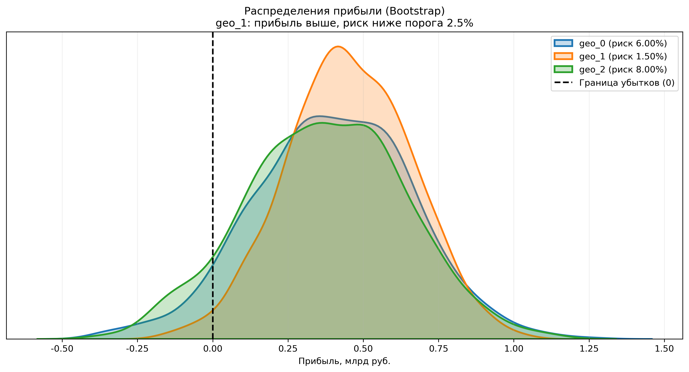

# 🛢️ Выбор региона нефтедобычи: прибыль и риски

ML для бизнес-решений: выбор региона для бурения новых скважин на основе прогноза запасов и оценки рисков методом **Bootstrap**.

**Результат: выбран регион с ожидаемой прибылью 452 млн руб. и риском убытков 1.5%** — единственный, удовлетворяющий бизнес-критерию (риск < 2.5%).




## 📋 Задача

Добывающей компании нужно решить, в каком из трёх регионов бурить новые скважины. По пробам нефти в каждом регионе требуется: построить модель прогноза объёма запасов, отобрать лучшие скважины по предсказаниям, рассчитать ожидаемую прибыль и риски и выбрать регион с максимальной прибылью при вероятности убытков менее 2.5%.

## 📊 Данные

Пробы нефти в трёх регионах (`geo_0`, `geo_1`, `geo_2`): по 100 тыс. скважин с тремя признаками качества сырья и целевой переменной — объёмом запасов.

## 🤖 Подход

1. Для каждого региона обучена **линейная регрессия** прогноза объёма запасов; качество оценено по RMSE на валидационной выборке;
2. По предсказаниям модели отбираются лучшие скважины в рамках бюджета разработки;
3. **Bootstrap (1000 итераций)** строит распределение прибыли для каждого региона — из него получены средняя прибыль, 95%-й доверительный интервал и риск убытков (доля отрицательных исходов).

## 📈 Результаты

| Регион | Средняя прибыль, млн руб. | Риск убытков |
| --- | --- | --- |
| **geo_1** | **452.1** | **1.5%** |
| geo_0 | 399.6 | 6.0% |
| geo_2 | 375.0 | 8.0% |

**Ключевой вывод:** регион с самой точной моделью и умеренными средними запасами (`geo_1`) оказался лучшим выбором — только он проходит порог риска, и он же даёт максимальную ожидаемую прибыль среди допустимых. Выбор по одной лишь средней прибыли без учёта риска привёл бы к другому — худшему — решению.

## 💡 Чему учит проект

Это задача не про максимизацию метрики модели, а про **принятие управленческого решения в условиях неопределённости**: моделирование распределения исходов (bootstrap) вместо точечной оценки, явный бизнес-критерий отбора (риск < 2.5%) и перевод качества модели в деньги.

## 🛠 Стек

`Python` · `pandas` · `NumPy` · `scikit-learn` · `SciPy` · `Matplotlib` · `Seaborn` · `Jupyter`

## 🚀 Как запустить

```bash
git clone https://github.com/foxypandas/oil-well-region-selection.git
cd oil-well-region-selection
pip install -r requirements.txt
jupyter notebook notebooks/oil_well_region_selection.ipynb
```

## 📁 Структура проекта

```
├── data/          # пробы нефти по трём регионам
├── notebooks/     # основной ноутбук
├── images/        # графики
└── requirements.txt
```
